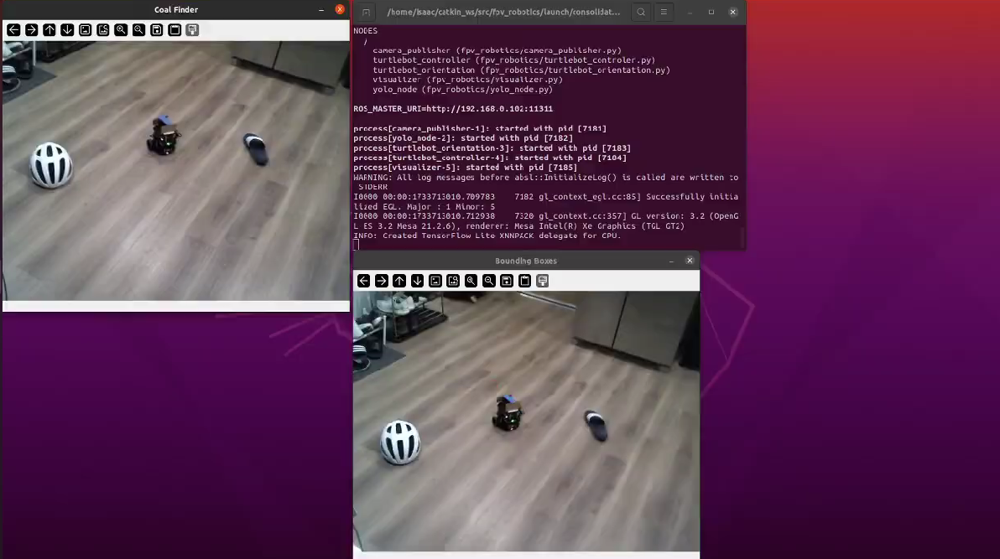

# FPV-Robotics

This project presents a novel approach to guiding a robot to a goal object using human first-person perspective (FPV) and pointing gestures. The guidance system utilizes real-time computer vision techniques to track the robot's location, estimate its orientation, and select a goal object based on the user's pointing gesture. The project demonstrates the feasibility of using FPV for human-robot interaction, with applications in assistive robotics and AR integration.

## Features

- **Real-Time Object Detection**: Uses YOLO for detecting the robot and target objects in the FPV camera feed.
- **Orientation Estimation**: Determines the robot’s forward orientation using computer vision techniques.
- **Pointing Gesture Recognition**: Tracks and recognizes human pointing gestures using the MediaPipe Hands library to select a goal object.
- **Robot Navigation**: The robot navigates toward the target using a simple algorithm based on the FPV data, adjusting its path as needed.

## Read the Report

For a detailed explanation of the project, please read the full report:  
[View the Report](./CSCI_5551_Report%20(1).pdf)

## See it in Action

## Future Work

Future work includes:
- Improving orientation detection using more sophisticated deep learning techniques.
- Expanding goal object detection to support a wider variety of objects.
- Exploring AR headset integration for enhanced user experience.

## Skills

- ROS
- Python
- OpenCV
- MediaPipe
- Ultralytics
- YOLO models
- Gesture Recognition
- Robot Navigation
- Computer Vision
- Real-Time Processing
- Algorithm Development
- Technical Writing
- Research
